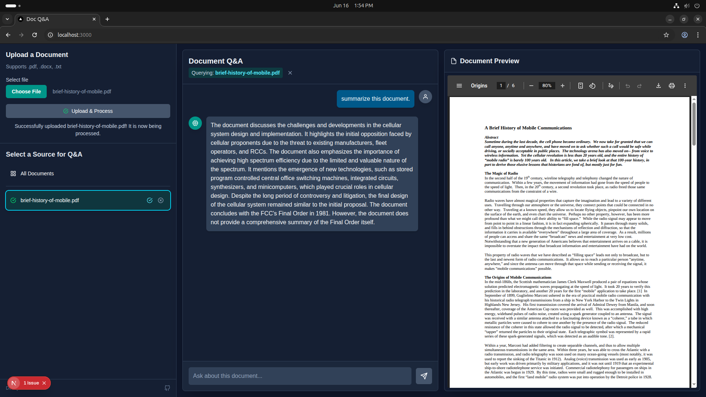

# 📄 Document Q&A with Next.js and FastAPI

This project provides a full-stack application that allows you to upload your documents (`.pdf`, `.docx`, `.txt`) and perform natural language question-and-answer searches on their content. It features a modern, responsive frontend built with Next.js and a powerful, LLM-driven backend powered by FastAPI.

  

---

## ✨ Features

- 📝 **Document Upload**: Supports `.pdf`, `.docx`, and `.txt` file formats.
- 📊 **Document Management**: View a list of all uploaded documents with their real-time processing status (Processing, Ready, Failed).
- 🤖 **Intelligent Q&A**:
  - Ask questions about a single, specific document.
  - Ask questions across all uploaded documents simultaneously.
- 👀 **Side-by-Side View**: Preview documents next to the chat interface for easy reference.
- 💅 **Modern UI**: Sleek, responsive interface using Tailwind CSS with a "Deep Space Teal" theme.
- 🗑️ **Safe Deletion**: Confirmation modal to prevent accidental document deletion.
- ⚙️ **Asynchronous Backend Processing**: Background processing lets you keep using the app during uploads.

---

## 🛠️ Tech Stack

| Area     | Technology |
|----------|------------|
| Frontend | Next.js 14 (App Router), React, TypeScript, Tailwind CSS |
| Backend  | FastAPI, Python 3.9+, Uvicorn |
| AI/ML    | LLM provider (e.g., OpenAI, Anthropic), Text Embedding Model, Vector DB (e.g., ChromaDB, FAISS) |

---

## 🚀 Getting Started

Follow these instructions to get the project running locally for development and testing.

### ✅ Prerequisites

- Node.js (v18.0 or later)
- Python (v3.9 or later) + pip
- API key from an LLM provider (e.g., OpenAI)

---

## ⚙️ Backend Setup (FastAPI)

1. **Clone the Repository**:
   ```bash
   git clone https://github.com/harshad208/llm_doc_search_project.git
   cd your-repository-url/

2. **Create a Virtual Environment**:
    ```bash
    python -m venv venv
    source venv/bin/activate  # On Windows: venv\Scripts\activate

3. **Install Dependencies**:
    ```bash
    pip install -r requirements.txt

4. **Set Up Environment Variables**:
    ``bash
    cp env.example .env

5. **Run the Backend Server**:
    ```bash
    python -m llm_doc_search_api.main


##  🖥️ Frontend Setup (Next.js)

1. **Navigate to the Frontend Directory**:
    ```bash
    cd doc-qna-app


2. **Install Dependencies**:
    ```bash
    npm install


3. **Set Up Environment Variables**:
    - Create a .env.local file:
    ```ini
    NEXT_PUBLIC_API_BASE_URL=http://127.0.0.1:8000

4. **Run the Development Server**:
    ```bash
    npm run dev

5. **Open the Application**:
    - Visit: http://localhost:3000


## 📌 Usage

- Upload a Document: Use the left sidebar form to upload a .pdf, .docx, or .txt file.

- Wait for Processing: Document status icons:

- ⏳ Clock/Spinner: Processing

-  ✅ Green Check: Ready

- Select a Source:

- Click a document to ask questions about it.

- Click "All Documents" to query across all uploaded files.

- Ask a Question: Type your question and press Enter.

- View the Answer: The LLM's response appears in the chat.

## 📝 API Endpoints Summary

| Endpoint                          | Description                             |
| --------------------------------- | --------------------------------------- |
| `POST /upload`                    | Upload a new document                   |
| `GET /documents/list`             | Get list of all uploaded documents      |
| `POST /search`                    | Submit a Q\&A query to the backend      |
| `GET /documents/preview/{doc_id}` | Fetch the raw document file for preview |
| `DELETE /docs/{doc_id}`           | Delete a document and its metadata      |


